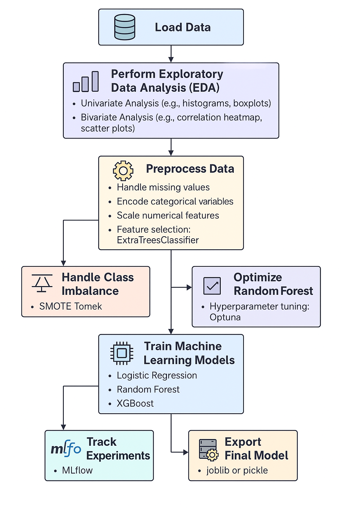

# 🚗 Health Insurance Cross-Sell Prediction

**Predict which health insurance customers are likely to purchase vehicle insurance using machine learning.**

---

## 📌 Problem Statement

The client is a leading insurance company offering Health Insurance. Now, they plan to cross-sell **Vehicle Insurance** to existing customers.  
They require a predictive model that can determine **whether a customer from the past year is likely to be interested in Vehicle Insurance**.

---

## 🎯 Business Objective

Building a reliable prediction model serves multiple business purposes:

- 🎯 **Targeted Campaigns** – Focus marketing efforts on high-potential customers.
- 💡 **Improved ROI** – Optimize conversion rates and reduce customer acquisition costs.
- 📊 **Data-Driven Strategy** – Make strategic decisions based on predictive insights.
- 💰 **Revenue Growth** – Increase cross-sell opportunities and customer lifetime value.

---

## 🔁 Workflow

---

## 📊 Exploratory Data Analysis (EDA)

_🚧 Section in Progress_

> This section will include key insights from EDA such as:

- Distribution of key features (e.g., Age, Annual Premium, Policy Sales Channel).
- Customer segments more likely to purchase vehicle insurance.
- Analysis of missing values, outliers, and class imbalance.
- Correlation heatmap of numerical variables.
- Feature importance overview.

---

## 🤖 Model Development & Evaluation

_🚧 Section in Progress_

> This section will cover the machine learning pipeline including:

- Data preprocessing: Handling nulls, encoding categoricals, scaling.
- Algorithms tried: Logistic Regression, Random Forest, XGBoost, etc.
- Model performance comparison using:
  - Accuracy
  - Precision, Recall, F1-score
  - ROC-AUC Curve
- Hyperparameter tuning (GridSearchCV / RandomizedSearchCV).
- Final model export and explanation.

---

## 📈 Business Conclusion

_🚧 Section in Progress_

> This section will summarize:

- Overall model performance and trustworthiness.
- Predicted conversion rates and business value.
- How this model supports smarter outreach campaigns.
- Recommendations for production deployment.

---

## 💻 Streamlit App

An interactive web app is developed using **Streamlit** to:

- Input customer details dynamically.
- Get instant predictions about their likelihood of vehicle insurance interest.
- View prediction probability with a clean, user-friendly interface.

---

## 🛠️ Tech Stack

| Category        | Tools & Libraries                                |
|----------------|--------------------------------------------------|
| Language        | Python                                           |
| Data Handling   | Pandas, NumPy                                    |
| Visualization   | Matplotlib, Seaborn, Plotly                      |
| ML Models       | Scikit-learn, XGBoost, Random Forest             |
| Web App         | Streamlit                                        |
| Serialization   | Joblib                                           |
| Deployment      | (Optional) Heroku, Docker, Streamlit Cloud       |

---

## 📁 Project Structure

